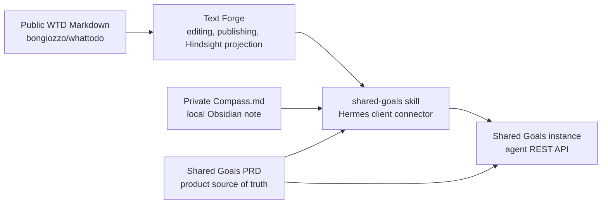

# Shared Goals — AI Companion Skills

This repository contains a small public skill set for Hermes Agent.
It is designed to keep reusable logic in git and keep personal data local.

## Shared Goals Repository Map

Read the repositories in this order when you need the whole system context:

1. [shared-goals/prd](https://github.com/shared-goals/prd) — product decisions, acceptance criteria, implementation contract, history, and research.
2. [shared-goals/instance](https://github.com/shared-goals/instance) — platform API, persistence, authentication, and backend tests.
3. [shared-goals/skill](https://github.com/shared-goals/skill) — Hermes skill set and local client connector for agents.
4. [shared-goals/text-forge](https://github.com/shared-goals/text-forge) — Markdown tooling, Obsidian helpers, publishing, inventory, and Hindsight projection.
5. [bongiozzo/whattodo](https://github.com/bongiozzo/whattodo) — public WTD Markdown text and laptop operator workflow.

This repository owns the Hermes skills and local client connector. The canonical component map lives in `shared-goals/prd`.

## Architecture Boundary

Shared Goals works with two Markdown contexts owned by the user:

- **Private context:** `Compass.md` is a local Obsidian note. It is used by the
	agent as working context for Shared Goals commits, next steps, and explicit
	user-approved updates. Private Markdown stays local; the platform receives
	normalized goals, contracts, commits, and recommendation text through its API.
- **Public context:** the WTD repository (`bongiozzo/whattodo`) is a public
	reflexive text. Agents use its Hindsight/Text Forge projections to better
	understand the user's values, followings, and likely acceptance of external
	activities. That context helps `shared-goals` choose potential shared goals
	and helps `wtd-content-analyze` compare outside text or video with WTD.

This repo is the Hermes client connector for the Shared Goals platform. It does
not publish WTD, build the public site, or own WTD reingest; those belong to the
text repository and Text Forge tooling.



## Shared Goals Platform

Shared Goals is an open platform for social architects: people who commit time
to shared purposes and multiply joy and Social Capital worldwide.

This repository includes skills that let an AI companion operate within that
platform model: define goals, contracts, commits, and daily direction.

The product philosophy, including no comparison pressure and no leaderboards,
is described in the [Shared Goals PRD](https://github.com/shared-goals/prd).

## What this skill will do

An AI companion (Hermes Agent) uses this skill to interact with the platform on behalf of the user:

- Join a shared Goal
- Set a personal Contract (time commitment)
- Log a Commit (progress report)

## What this skill does now

- Run a **Daily Compass** — a daily projection of active contracts across life dimensions
- Consume the platform `GET /api/v1/compass/next-steps` feed when configured,
  then merge those joined-contract next steps into the Daily Compass runtime
- Provide the connector used by the WTD `make compass-update` workflow to update
  local `Compass.md` from the configured Shared Goals platform endpoint

Daily Compass is the seed of something larger: a companion that asks each morning *"What do my contracts say about today?"* and helps the user feel the right proportion of time across dimensions of balanced life.

## Skills In This Repo

1. `shared-goals`
	- Shared Goals platform model and schema skill.
	- Owns entities, dimensions, area-file format, and API contract notes.
2. `sg-area-craft`
	- Area engineer skill for creating or modifying Daily Compass area skills.
	- Enforces deterministic, test-first workflows.
3. `wtd-content-analyze`
	- Compares outside text or video with WTD using Hindsight and verified source quotations.
	- Can hand off an approved completed analysis to `lesson-maker`.
4. `lesson-maker`
	- Builds reusable self-contained HTML lessons from a topic or completed analysis.
	- General-purpose; WTD-specific research belongs in `wtd-content-analyze`.
5. `wtd-wiki`
	- Pilot skill for maintaining a local wiki over the WTD corpus.
	- Still experimental and should be sanitized further before broader use.

## Local-Only Area Skills

Personal area skills are intentionally outside this repo in:

`~/.hermes/skills/shared-goals/areas/`

They are referenced by pattern, not committed here.
This prevents accidental publication of private context such as paths, hostnames, or personal mappings.

### Current local area set

Current local areas cover 11 domains:

- calendar and scheduling
- finance and accounting
- health and wellbeing
- mail triage
- music discovery
- news monitoring
- photo and memory prompts
- Shared Goals PRD tracking
- Personal Assistant developing
- household/property management
- weather

## Four Dimensions

Every Commit carries a `dimension_tag`:

| Tag | Meaning |
|-----|---------|
| `faith` | Acting in uncertainty toward a meaningful path |
| `will` | Obligations, contracts, routine |
| `feeling` | Creativity, hobbies, subjective experience |
| `mind` | Analysis, knowledge, cognitive work |

Hunger-first principle: the dimension least fed recently gets attention first.

## Daily Compass

Daily Compass uses area status payloads to project the day across dimensions.
The long-term target is SG platform-backed calculation.
Until then, local skills can emit placeholders such as `[TBD]`.

### Updating Compass.md

`compass-update.py` is the connector implementation for updating a local
`Compass.md` from a Shared Goals platform endpoint. In the WTD laptop workflow,
the user-facing target lives beside WTD ingest in the `bongiozzo/whattodo`
Makefile:

```bash
make compass-update
```

That target loads `SHARED_GOALS_API_BASE_URL` and `SHARED_GOALS_AGENT_KEY_ID`
from the WTD repo `.env` or the shell, resolves `Compass.md` from
`OBSIDIAN_VAULT_PATH` or `~/Compass.md`, and calls this skill's connector
script. Completed checked items can be proposed as commits; commit creation
remains user-approved.

The WTD target renders `## Logos` from a `daily-compass-context.json` snapshot
with `--logos-context`. This lets a laptop workflow use a local context file or
fetch one from an always-on Hermes host over SSH before writing `Compass.md`.

WTD reingest is intentionally not triggered here. Reingest of the public WTD
text is initiated from the WTD/Text Forge workflow.

## Area Skill Pattern

An area skill typically has:

1. `SKILL.md` with area instructions and `## Area signal`
2. `scripts/daily-<area>-status.py` boundary script that emits strict JSON
3. optional local config in `references/` files (gitignored)

## Personal Configuration Safety

Any personal area mapping/configuration belongs in `references/` files under local skills.
These files must stay out of git.

Example schema:

```yaml
name: Example Area
dimensions: [faith, will]
skill: example-area
status: active
notes: ""
```

## Related

- [Shared Goals PRD](https://github.com/shared-goals/prd)
- [Hermes Agent](https://hermes-agent.nousresearch.com)
